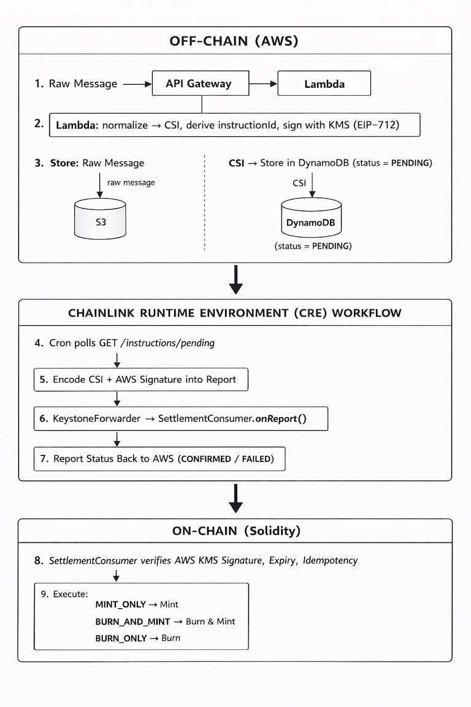

# Bridging financial messaging systems to digital asset settlement  

A hybrid off-chain/on-chain settlement system that bridges traditional financial messages (SWIFT, ISO 20022, etc.) to blockchain token operations, using AWS for ingestion/signing/storage and Chainlink Runtime Environment (CRE) for orchestration and decentralized execution.

Each incoming message is normalized into a single canonical payload used across AWS, CRE, and onchain.

This payload, defined as a **Canonical Settlement Instruction (CSI)**, is the minimal, deterministic, KMS-signed representation of a settlement. It encodes canonical semantics (asset, amount, parties, value time, intent, chain) and yields a stable `instructionId` for auditability and safe retries, while keeping raw messages off-chain.

## Table of Contents

- [Architecture](#architecture)
- [Key Security Properties](#key-security-properties)
- [Idempotency](#idempotency)
- [Settlement Intents](#settlement-intents)
- [Repository Structure](#repository-structure)
- [Prerequisites](#prerequisites)
- [Deployment](#deployment)
- [Testing](#testing)
- [Web UI](#web-ui)
- [Mainnet Deployment](#mainnet-deployment)
- [Key Rotation](#key-rotation)
- [Configuration Files](#configuration-files)
- [Component Documentation](#component-documentation)

## Architecture



See also:
[Detailed Architecture Diagram](diagrams/components.png) and [Process Flow](diagrams/end-to-end-flow.svg)

## Key Security Properties

- **Separation of duties**: CRE orchestration cannot forge settlements—only KMS-signed instructions are accepted
- **Auditability**: Deterministic `instructionId` links AWS logs, CRE execution, and on-chain events
- **Compliance**: Raw messages stay off-chain; only hashes and canonical semantics go on-chain
- **Idempotency**: Safe retries across AWS, CRE, and on-chain layers (see below)
- **Key management**: KMS/HSM signing with on-chain allowlist and rotation support

## Idempotency

The system has two layers of idempotency protection:

**AWS Layer (DynamoDB)**
- Before creating an instruction, Lambda computes an idempotency key:
  ```
  keccak256("CSI_IDEMPOTENCY_V1" || messageDigest || asset || amount || fromParty || toParty || valueTime || intent || chainId || referenceHash)
  ```
- If the key exists → return existing instruction (no duplicate)
- If not → create new instruction and store the mapping
- Enables safe retries if API calls fail or timeout

**On-Chain Layer (Solidity)**
```solidity
mapping(bytes32 => bool) public executed;

require(!executed[csi.instructionId], "ALREADY_EXECUTED");
executed[csi.instructionId] = true;
// ... execute mint/burn
```
- Each `instructionId` can only be settled once
- Protects against CRE network retries or duplicate triggers

## Settlement Intents

| Intent | Description | Token Effect |
|--------|-------------|--------------|
| `MINT_ONLY` | New value enters system (issuance/deposit) | `totalSupply` increases |
| `BURN_AND_MINT` | Value moves within system (transfer) | `totalSupply` unchanged |
| `BURN_ONLY` | Value exits system (redemption/withdrawal) | `totalSupply` decreases |

## Repository Structure

```
├── aws/                    # Lambda + KMS signing + CSI logic
├── infra/                  # CDK stack (API Gateway, Lambda, DynamoDB, S3, KMS)
├── contracts/              # Solidity (SettlementConsumer, Token, KeyRegistry)
├── cre/                    # Chainlink CRE workflow
├── examples/               # Sample payloads
├── scripts/                # Operational helpers
├── TEST_PLAN.md           # Manual test checklist
└── ARCHITECTURE.md        # Component reference
```

## Prerequisites

- AWS CLI configured with credentials
- Node.js + CDK CLI: `npm install -g aws-cdk`
- Python 3.11+
  1. `uv init && uv venv && uv add pip`
- Foundry:
  1. `curl -L https://foundry.paradigm.xyz | bash`
  2. source environment and run `foundryup` 
- Funded Sepolia account (use a [faucet](https://sepoliafaucet.com/))
- Chainlink CRE CLI (for workflow simulation/deployment):
  1. `curl -sSL https://cre.chain.link/install.sh | bash`
  2. source environment to have `cre` command available
  3. `cre login` (requires registration with email address)

## Deployment

### Quick Start (Recommended)

```bash
# 1. Configure your private key
cp .env-sample .env
# Edit .env and set PRIVATE_KEY (funded Sepolia account, with 0x prefix)

# 2. Deploy everything
./scripts/deploy.sh
```

This single script handles:
- AWS infrastructure (API Gateway, Lambda, DynamoDB, S3, KMS)
- KMS signer address extraction
- Smart contract deployment to Sepolia
- AWS update with contract address
- CRE workflow configuration

After deployment completes, continue to [Testing](#testing) to verify the setup.

### Manual Deployment

<details>
<summary>Click to expand manual steps</summary>

#### Step 1: Deploy AWS Infrastructure

```bash
cd infra
pip install -r requirements.txt
cdk bootstrap  # first time only

# Deploy
cdk deploy -c verifyingContract=0x0000000000000000000000000000000000000000 -c chainId=11155111
```

#### Step 2: Configure Environment Variables

```bash
# Copy sample environment file
cp .env-sample .env

# Edit .env and set your PRIVATE_KEY (funded Sepolia account, with 0x prefix)
# All other variables (KMS_SIGNER, YOUR_ADDRESS, contract addresses) will be auto-populated by the deployment script
```

#### Step 3: Get KMS Signer Address

```bash
KMS_SIGNER=$(PYTHONPATH=. python3 scripts/kms_signer_address.py \
  --key-id $(aws cloudformation describe-stacks --stack-name SettlementStack \
  --query 'Stacks[0].Outputs[?OutputKey==`KmsKeyId`].OutputValue' --output text) \
  --region us-east-1)
echo "KMS_SIGNER=$KMS_SIGNER" >> .env
```

#### Step 4: Deploy Smart Contracts (Sepolia)

```bash
./scripts/deploy-contracts.sh
```

#### Step 5: Update AWS with Contract Address

```bash
source .env
cd infra
cdk deploy -c verifyingContract=$SETTLEMENT_CONSUMER -c chainId=11155111
```

#### Step 6: Configure CRE Workflow

```bash
# Install CRE workflow dependencies
cd cre && go mod tidy && cd ..

# Get API key from CloudFormation
API_KEY_ID=$(aws cloudformation describe-stacks --stack-name SettlementStack \
  --query 'Stacks[0].Outputs[?OutputKey==`ApiKeyId`].OutputValue' --output text)

AWS_API_KEY=$(aws apigateway get-api-key --api-key $API_KEY_ID --include-value \
  --query 'value' --output text)

# Get API base URL
API_BASE=$(aws cloudformation describe-stacks --stack-name SettlementStack \
  --query 'Stacks[0].Outputs[?OutputKey==`ApiBaseUrl`].OutputValue' --output text)

# Add API key and private key to CRE .env
source .env
cat > cre/.env << EOF
AWS_API_KEY_VALUE=$AWS_API_KEY
CRE_ETH_PRIVATE_KEY=$PRIVATE_KEY
EOF

# Update CRE config with deployed contract address
cat > cre/settlement-workflow/config.staging.json << EOF
{
  "schedule": "*/10 * * * * *",
  "awsApiBase": "$API_BASE",
  "receiverAddress": "$SETTLEMENT_CONSUMER",
  "chainSelector": 16015286601757825753,
  "chainId": 11155111,
  "gasLimit": 1200000,
  "workflowRunId": "staging"
}
EOF

# Verify CRE config
cat cre/settlement-workflow/config.staging.json
```

</details>

## Testing

### Setup Test Environment

```bash
source .env  # Load contract addresses
export API_BASE=$(aws cloudformation describe-stacks --stack-name SettlementStack \
  --query 'Stacks[0].Outputs[?OutputKey==`ApiBaseUrl`].OutputValue' --output text)

# Get API key for authenticated requests
API_KEY_ID=$(aws cloudformation describe-stacks --stack-name SettlementStack \
  --query 'Stacks[0].Outputs[?OutputKey==`ApiKeyId`].OutputValue' --output text)
export AWS_API_KEY=$(aws apigateway get-api-key --api-key $API_KEY_ID --include-value \
  --query 'value' --output text)
```

### Test Flow 1: MINT_ONLY (Issuance/Deposit)

New value enters the system - mints tokens to recipient.

**Step 1: Submit mint instruction**
```bash
curl -X POST "$API_BASE/messages" \
  -H "X-API-Key: $AWS_API_KEY" \
  -H "Content-Type: application/json" \
  -d "{
    \"rawMessage\": \"MINT-TEST-$(date +%s)\",
    \"asset\": \"$TOKEN\",
    \"amount\": \"1000000000000000000\",
    \"fromParty\": \"0x0000000000000000000000000000000000000000\",
    \"toParty\": \"0x1234567890123456789012345678901234567890\",
    \"valueTime\": $(date +%s),
    \"intent\": \"MINT_ONLY\",
    \"chainId\": 11155111,
    \"reference\": \"MINT-001\"
  }" | jq -r '.instruction.instructionId'
```

**Step 2: Execute via CRE (broadcasts to Sepolia)**
```bash
cd cre && cre workflow simulate settlement-workflow --target staging-settings --broadcast
```

**Step 3: Verify on-chain results**
```bash
# Check recipient balance (should be 1 ETH)
cast call $TOKEN "balanceOf(address)(uint256)" 0x1234567890123456789012345678901234567890 --rpc-url $RPC_URL

# Check total supply increased
cast call $TOKEN "totalSupply()(uint256)" --rpc-url $RPC_URL
```

### Test Flow 2: BURN_AND_MINT (Transfer)

Value moves within system - burns from sender, mints to recipient. Total supply unchanged.

**Step 1: Submit transfer instruction**
```bash
curl -X POST "$API_BASE/messages" \
  -H "X-API-Key: $AWS_API_KEY" \
  -H "Content-Type: application/json" \
  -d "{
    \"rawMessage\": \"TRANSFER-TEST-$(date +%s)\",
    \"asset\": \"$TOKEN\",
    \"amount\": \"500000000000000000\",
    \"fromParty\": \"0x1234567890123456789012345678901234567890\",
    \"toParty\": \"0xabcdefabcdefabcdefabcdefabcdefabcdefabcd\",
    \"valueTime\": $(date +%s),
    \"intent\": \"BURN_AND_MINT\",
    \"chainId\": 11155111,
    \"reference\": \"TRANSFER-001\"
  }" | jq -r '.instruction.instructionId'
```

**Step 2: Execute via CRE (broadcasts to Sepolia)**
```bash
cre workflow simulate settlement-workflow --target staging-settings --broadcast
```

**Step 3: Verify on-chain results**
```bash
# Check sender balance decreased
cast call $TOKEN "balanceOf(address)(uint256)" 0x1234567890123456789012345678901234567890 --rpc-url $RPC_URL

# Check recipient balance increased
cast call $TOKEN "balanceOf(address)(uint256)" 0xabcdefabcdefabcdefabcdefabcdefabcdefabcd --rpc-url $RPC_URL

# Check total supply unchanged
cast call $TOKEN "totalSupply()(uint256)" --rpc-url $RPC_URL
```

### Test Flow 3: BURN_ONLY (Redemption/Withdrawal)

Value exits the system - burns tokens from holder.

**Step 1: Submit burn instruction**
```bash
curl -X POST "$API_BASE/messages" \
  -H "X-API-Key: $AWS_API_KEY" \
  -H "Content-Type: application/json" \
  -d "{
    \"rawMessage\": \"BURN-TEST-$(date +%s)\",
    \"asset\": \"$TOKEN\",
    \"amount\": \"250000000000000000\",
    \"fromParty\": \"0x1234567890123456789012345678901234567890\",
    \"toParty\": \"0x0000000000000000000000000000000000000000\",
    \"valueTime\": $(date +%s),
    \"intent\": \"BURN_ONLY\",
    \"chainId\": 11155111,
    \"reference\": \"BURN-001\"
  }" | jq -r '.instruction.instructionId'
```

**Step 2: Execute via CRE (broadcasts to Sepolia)**
```bash
cre workflow simulate settlement-workflow --target staging-settings --broadcast
```

**Step 3: Verify on-chain results**
```bash
# Check holder balance decreased
cast call $TOKEN "balanceOf(address)(uint256)" 0x1234567890123456789012345678901234567890 --rpc-url $RPC_URL

# Check total supply decreased
cast call $TOKEN "totalSupply()(uint256)" --rpc-url $RPC_URL
```

### Check Pending Instructions

```bash
curl -H "X-API-Key: $AWS_API_KEY" "$API_BASE/instructions/pending" | jq .
```

### Verify On-Chain Execution

```bash
# Check if instruction was executed
cast call $SETTLEMENT_CONSUMER "executed(bytes32)(bool)" <INSTRUCTION_ID> --rpc-url $RPC_URL
```

See [TEST_PLAN.md](./TEST_PLAN.md) for the complete test checklist including negative paths.

## Web UI

A React dashboard for managing settlement instructions.

```bash
cd web-ui
npm install
./scripts/fetch-config.sh  # Auto-populate .env.local from AWS
npm run dev
```

Open http://localhost:5173.

Features: Dashboard with pending/confirmed counts, create instructions, view instruction details with on-chain status, CRE simulation command display.

## Mainnet Deployment

For mainnet deployment guidance (changing chains, RPC, chain selector, and forwarder), see the [CRE deployment notes](https://github.com/racket2000/financial-messages-orchestration/blob/main/cre/README.md#changing-chains-rpc--chain-selector--forwarder).

## Key Rotation

```bash
# 1. Generate new KMS key and get address
NEW_SIGNER=$(python3 scripts/kms_signer_address.py --key-id <new-key-id> --region us-east-1)

# 2. Add to KeyRegistry
cast send $KEY_REGISTRY "addSigner(address)" $NEW_SIGNER --private-key $ADMIN_PK --rpc-url $RPC_URL

# 3. Update AWS Lambda environment with new KMS_KEY_ID

# 4. Remove old signer (after transition period)
cast send $KEY_REGISTRY "removeSigner(address)" $OLD_SIGNER --private-key $ADMIN_PK --rpc-url $RPC_URL
```


## Configuration Files

- Root `.env`: local operator/deployment values consumed by scripts. Start from `.env-sample`.
- `cre/.env`: generated by `scripts/deploy.sh` for CRE runtime secrets.
- `cre/settlement-workflow/config.staging.json`: generated by `scripts/deploy.sh` with deployed addresses.
- `web-ui/.env.local`: generated by `web-ui/scripts/fetch-config.sh` or set manually.

## Component Documentation

- [AWS Lambda & API](./aws/README.md) - API contract, signing details
- [Smart Contracts](./contracts/README.md) - Solidity contracts (SettlementConsumer, Token, KeyRegistry)
- [CRE Workflow](./cre/README.md) - Chainlink workflow configuration
- [Settlement Workflow](./cre/settlement-workflow/README.md) - Workflow implementation details
- [Architecture Reference](./ARCHITECTURE.md) - Component details and trust boundaries
- [Context Files](./context/) - Design rationale and deep technical context
